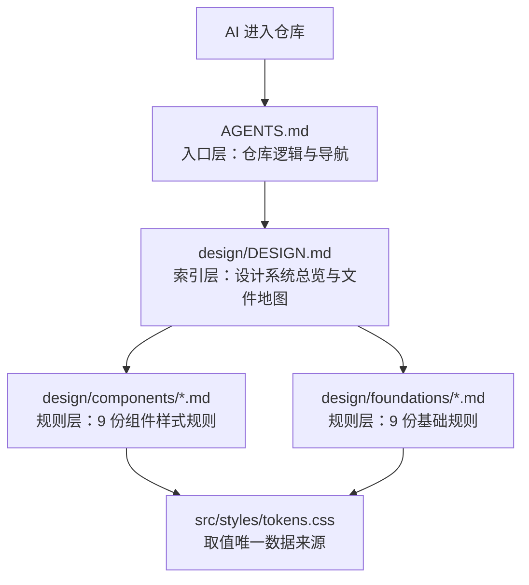

# ddo-web 规范索引与样式规则拆分 技术 Plan

> revision: 1 ｜ 文档模式: single ｜ 依据: `run://.ddo/runs/feat/2026-08-29-design-specs-index/spec.md`（已批准）

---

## 执行摘要

将根目录 DESIGN.md（445 行、未入 git 的样式规则唯一权威）拆分重组为 `design/` 规范索引目录：1 份整体索引（`design/DESIGN.md`）+ 9 份组件样式规则文件 + 9 份基础规则文件；根目录新增 `AGENTS.md` 作为 AI 理解仓库的入口，形成「AGENTS.md → design/DESIGN.md → 规则文件」的三层加载结构。同步修正 CLAUDE.md / README.md / CONTRIBUTING.md 中指向旧路径（`../ddo-design/DESIGN.md` 与根 `DESIGN.md`）的权威来源描述。全过程不改变任何视觉取值，样式数值以 `src/styles/tokens.css` 为唯一数据来源。

---

## 范围与非目标

| 类别 | 内容 | AI 索引 |
|---|---|---|
| 范围内 | 新建 `design/` 索引目录（索引 + 组件规则 + 基础规则，共 19 份文件） | FR-INDEX-1、FR-SPLIT-1、FR-SPLIT-2 |
| 范围内 | 根目录新增 `AGENTS.md`（仓库逻辑 + 分层导航入口） | FR-AGENTS-1 |
| 范围内 | 根目录旧 `DESIGN.md` 内容迁移后删除，索引文件落位 `design/DESIGN.md` | FR-DESIGNMD-1 |
| 范围内 | 更新 CLAUDE.md、README.md、CONTRIBUTING.md 的权威来源指向 | FR-GUIDE-1 |
| 范围外 | 不改任何视觉取值；不改 `tokens.css` 与 `src/` 组件实现 | 约束 |
| 范围外 | 不为不存在的组件预写规则；不发布站点页面；不改动组件内引用旧章节号的 JSDoc 注释（列为后续跟进） | Non-goal |

---

## 现有设计与复用基线

| 能力说明 | 文件路径 | 符号 | 证据类型 | 采用方式 | 适用边界 | AI 索引 |
|---|---|---|---|---|---|---|
| 设计 token 全集（色彩/间距/圆角/高度/字体/阴影），dark/light 双主题 | `src/styles/tokens.css` | `:root`、`:root[data-theme='light']` | Repository Fact | 复用现有实现 | 规则文件引用取值的唯一来源，不得新增数值 | FR-CONSIST-1 |
| 全局基础样式（滚动条收编、焦点环、排版基准） | `src/styles/global.css` | `*{scrollbar-width}`、`::-webkit-scrollbar*` | Repository Fact | 复用现有实现 | 滚动条规则文件的实现参照，内容需与其一致 | FR-SPLIT-1 |
| 已实现组件（Button/Table/Tabs/Card/Badge/Nav/CodeBlock/DotNav/Footer + Icon 注册表） | `src/components/**` | 各组件 `.module.css` 均引用 `var(--token)` | Repository Fact | 复用现有实现 | 组件规则文件须与既有实现的 token 用法一致；既有实现是规则的例证而非修改对象 | FR-SPLIT-1 |
| 组件 JSDoc 注明 DESIGN.md 章节的约定 | `CONTRIBUTING.md` | 「组件文件顶部用 JSDoc 注明对应 DESIGN.md 章节」 | Repository Fact | 扩展现有实现 | 约定改为注明 `design/` 规则文件；存量组件注释本次不改 | FR-GUIDE-1 |
| 仓库命令与完成标准（nvm exec 22；lint+build） | `CLAUDE.md` | 「命令」「完成标准」节 | Repository Fact | 复用现有实现 | 验收沿用该标准 | 约束 |

---

## 整体架构与流程

分层加载结构（AI 上下文逐层细化，每层独立可读并指向下一层）：

- 入口层只讲「这个仓库是什么、规范在哪、怎么读」，不复制规则内容。
- 索引层承载设计哲学摘要、文件地图（文件 → 管辖范围 → 关键 token）、迭代守则与裁决记录。
- 规则层每份文件自包含单一组件/领域的完整规则，取值一律引用 token 变量名。

---

## 技术选型与方案对比

| 候选 | 状态 | 关键差异与结论 | AI 索引 |
|---|---|---|---|
| 根级 `design/` 目录 | accepted | 与 `src/` 平级、路径短、AI 加载友好；命名延续 DESIGN.md/tokens.css 词汇 | DEC-1 |
| `docs/design/` | rejected | docs/ 当前不存在且易与非设计文档混杂；路径更长，无额外收益 | DEC-1 |
| `.claude/rules/` | rejected | 工具专属、对人类协作者隐藏，违背「规范目录」的公开性 | DEC-1 |

关键决策：

| ID | 结论 | 依据与权衡 | 影响范围 | 回退条件 | AI 索引 |
|---|---|---|---|---|---|
| DEC-1 | 目录结构：`design/DESIGN.md` + `design/components/*.md` + `design/foundations/*.md` | 用户已定「规范目录中维护 DESIGN.md 作为整体索引」；组件/基础分治便于按需加载 | 全部新文件 | 用户否决目录位置 | PD-1 |
| DEC-2 | 索引文件结构：哲学与主题摘要 → 分层加载说明 → 文件地图表（文件/管辖范围/关键 token）→ 迭代守则（原 §10.3）→ 裁决与迁移记录 | 索引的职责是导航与总览，不放具体规则 | `design/DESIGN.md` | 用户要求调整索引职责 | PD-2 |
| DEC-3 | 规则文件统一模板：概述 → token 引用 → 规则细则（变体/尺寸/状态/焦点/禁用）→ Do's & Don'ts（自 §8 过滤归属）→ AI 实现检查清单 → 示例 prompt（原 §10.2 按组件归位） | 统一结构让 AI 可预期地定位信息；§8/§10.2 内容按归属下沉到组件文件，全局性条目留在 `foundations/dos-and-donts.md` | 18 份规则文件 | 用户否决模板 | PD-3 |
| DEC-4 | AGENTS.md 与 CLAUDE.md 边界：AGENTS.md 讲仓库逻辑与分层导航（项目定位/技术栈/目录结构/命令速览/各层指针），不复制铁律；CLAUDE.md 保留铁律、命令与完成标准并更新权威来源指向；二者互引 | 避免双份维护漂移；AGENTS.md 面向通用 AI 代理，CLAUDE.md 面向本工具链协作约定 | `AGENTS.md`、`CLAUDE.md` | 用户要求合并或互换职责 | PD-5 |
| DEC-5 | 内容裁决留痕：`text-tertiary` dark 取 `#71717A`（§10.1 的 `#71737A` 判为笔误）；信号色为绿 `accent`、等宽字体为 Fira Code（§1 叙述以 §2/§3 token 表与 tokens.css 为准）；裁决与旧章节→新文件映射记入索引「裁决与迁移记录」 | tokens.css 与 CLAUDE.md 双重佐证；留痕保证可追溯 | 索引 + 受影响规则文件 | 用户要求逐字保留 | PD-4 |

---

## 数据模型设计

### 实体与字段
不适用及原因：本次为文档/规范工程，无数据库、无业务实体。

### schema 与 DDL（如适用）
不适用及原因：同上。

### 状态与不变量
不适用及原因：同上。文档不变量在「兼容、稳定性与回滚」中以内容契约表达。

### 迁移、兼容与回滚
不适用及原因：无数据迁移；文档回滚见「兼容、稳定性与回滚」。

---

## API 接口设计

不适用及原因：无服务端、无对外接口。唯一的「接口」是文档间的引用关系：规则文件只允许以 `var(--token)` / token 名引用取值（契约见 Verification Anchor）。

---

## 算法设计

不适用及原因：无非平凡算法、状态机或并发逻辑；内容迁移是确定性的章节映射，映射表见索引「裁决与迁移记录」。

---

## 文件变更计划

| 文件/模块 | 职责与契约 | 动作 | AI 索引 |
|---|---|---|---|
| `design/DESIGN.md` | 整体索引：总览、文件地图、迭代守则、裁决与迁移记录 | 新增（由根 DESIGN.md 重构） | FR-DESIGNMD-1 |
| `design/components/button.md` | 按钮（§4.2） | 新增 | FR-SPLIT-1 |
| `design/components/tags-and-status.md` | 标签与状态点（§4.3） | 新增 | FR-SPLIT-1 |
| `design/components/inputs-and-forms.md` | 输入与表单（§4.4） | 新增 | FR-SPLIT-1 |
| `design/components/navigation.md` | 导航（§4.5） | 新增 | FR-SPLIT-1 |
| `design/components/cards-and-panels.md` | 卡片与面板（§4.6） | 新增 | FR-SPLIT-1 |
| `design/components/tabs.md` | Tabs（§4.7） | 新增 | FR-SPLIT-1 |
| `design/components/dense-table.md` | 密集表格（§4.8） | 新增 | FR-SPLIT-1 |
| `design/components/toast.md` | 反馈 Toast（§4.9） | 新增 | FR-SPLIT-1 |
| `design/components/scrollbar.md` | 滚动条（§4.10） | 新增 | FR-SPLIT-1 |
| `design/foundations/colors.md` | 色彩系统与主题映射（§2） | 新增 | FR-SPLIT-2 |
| `design/foundations/typography.md` | 排版系统（§3） | 新增 | FR-SPLIT-2 |
| `design/foundations/control-scale.md` | 控件尺寸标度（§4.1） | 新增 | FR-SPLIT-2 |
| `design/foundations/spacing-and-radius.md` | 间距与圆角（§5） | 新增 | FR-SPLIT-2 |
| `design/foundations/elevation.md` | 层级、阴影与焦点表达（§6） | 新增 | FR-SPLIT-2 |
| `design/foundations/icons-and-graphics.md` | 图标与图形资源策略（§7） | 新增 | FR-SPLIT-2 |
| `design/foundations/responsive.md` | 响应式行为（§9） | 新增 | FR-SPLIT-2 |
| `design/foundations/dos-and-donts.md` | 全局 Do's & Don'ts（§8） | 新增 | FR-SPLIT-2 |
| `design/foundations/token-quick-reference.md` | token 速查（§10.1） | 新增 | FR-SPLIT-2 |
| `AGENTS.md` | 入口层：仓库逻辑与分层导航 | 新增 | FR-AGENTS-1 |
| `CLAUDE.md` | 权威来源指向改为 `design/DESIGN.md` + tokens.css | 修改 | FR-GUIDE-1 |
| `README.md`、`CONTRIBUTING.md` | 修正 `../ddo-design/DESIGN.md` 旧路径引用与章节注释约定 | 修改 | FR-GUIDE-1 |
| 根 `DESIGN.md` | 内容迁移完成后删除 | 删除 | FR-DESIGNMD-1 |

约束：`.ddo/` 下运行产物一律不提交；不修改 `.gitignore`。

---

## 兼容、稳定性与回滚

| 维度 | 结论 | AI 索引 |
|---|---|---|
| 兼容 | 旧章节号（如 §4.6）在新结构失效；存量组件 JSDoc 注释本次不改，列入后续跟进；对外部无接口影响 | 风险 |
| 回滚 | 全部改动为新增/文档修改，`git revert` 单个提交即可整体回滚；根 DESIGN.md 原文保留在迁移记录可追溯 | 约束 |
| 构建 | 不改 `src/` 与配置，`npm run lint` / `npm run build`（nvm exec 22）应保持通过，作为验收硬门槛 | AC |
| 主工作树 | 主工作树遗留的未跟踪旧 `DESIGN.md` 副本不受本次改动影响，交付说明中提示用户自行清理 | 交接 |

---

## Verification Anchor

| 契约 | 验证方式 | AI 索引 |
|---|---|---|
| 索引可导航：任一 §4 组件名能从 `design/DESIGN.md` 找到规则文件 | 人工/脚本核对文件地图 | AC-1 |
| 内容全覆盖：原 DESIGN.md 每节有归属文件，无丢失 | 逐节对照清单（§1–§10 → 文件映射） | AC-4 |
| 取值只引用 token 名：新文件无裸 hex、无标度外数值（代码示例中的 CSS 变量定义除外） | grep 检查 + 抽查对照 tokens.css | AC-3 |
| 分层导航连通：AGENTS.md → design/DESIGN.md → 各规则文件的相对链接均可解析 | 链接核对 | AC-7 |
| 旧文件与旧指向清除：根无 `DESIGN.md`；CLAUDE.md/README/CONTRIBUTING 不再指向 `../ddo-design/DESIGN.md` | grep 检查 | AC-5、AC-6 |
| 仓库健康：`npm run lint` 与 `npm run build`（nvm exec 22）通过 | 命令执行 | 约束 |

---

## 开放问题与 Spec 对应

| Spec 项 | 答案 | AI 索引 |
|---|---|---|
| BQ-1（DESIGN.md 去向） | 已由用户决定：迁入 `design/` 作为整体索引文件；另增根级 AGENTS.md 分层加载 | 已解决 |
| PD-1 目录位置/命名 | `design/` + `components/` + `foundations/`，文件名 kebab-case（见文件变更计划） | DEC-1 |
| PD-2 索引呈现 | 文件地图表 + 分层加载说明（DEC-2） | DEC-2 |
| PD-3 规则文件内置内容 | 统一模板含 Do/Don'ts、AI 检查清单、示例 prompt（DEC-3） | DEC-3 |
| PD-4 裁决记录形式 | 索引内「裁决与迁移记录」节（DEC-5） | DEC-5 |
| PD-5 AGENTS.md/CLAUDE.md 边界 | 入口/铁律分治、互引不复制（DEC-4） | DEC-4 |

---

## 风险与下游交接

- **内容漂移风险**：拆分过程可能改写数值。缓解：规则文件数值逐项对照原文与 tokens.css，Verification 抽查。
- **覆盖缺口风险**：§4.1 等跨组件内容易遗漏。缓解：以「§1–§10 → 文件映射」清单逐节核销（AC-4）。
- **双份维护风险**：AGENTS.md 与 CLAUDE.md 内容重叠会漂移。缓解：DEC-4 的分治边界 + 互引。
- **下游交接**：Test-Planning 依据 Verification Anchor 生成验收清单；Tasking 按「索引/基础文件/组件文件/入口与指向更新」拆分任务，组件文件之间相互独立可并行；Coding 逐文件对照原文迁移，不改 `src/`。

---

## 用户确认

- ✅ **同意**：批准当前 revision，进入 **Test-Planning**。
- ❌ **修改：<反馈>**：生成新 revision 并重新确认。
- ❓ **提问：<问题>**：仅答疑，不修改文档或确认状态。
